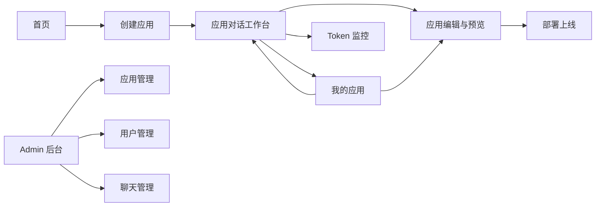

# 熵擎 AI 前端页面规划与设计方案

## 文档用途

这份文档不是视觉灵感稿，也不是泛泛的 UI 建议。

这是一份给后续 Claude Code 直接执行的前端改造蓝图，目标是让它在不理解你全部业务上下文的情况下，依然能按统一方向稳定推进改造。

因此本文档会尽量明确以下内容：

- 当前问题到底是什么
- 页面应该如何分层
- 每类页面承担什么职责
- 每个核心页面应该长成什么结构
- 哪些文件应该先动，哪些文件后动
- 每个阶段改造后，验收标准是什么

如果后续你把这份文档交给 Claude Code，建议它先按“阶段执行”，不要一次性大改全站。

---

## 1. 项目背景与改造目标

### 1.1 当前项目定位

项目是一个 AI 应用生成平台，核心链路不是普通内容站，也不是普通后台，而是一个带生成流程的产品工作台。

它的主业务路径是：

1. 用户输入需求
2. 系统创建应用
3. 用户进入对话页继续迭代
4. 用户进入编辑/预览页确认结果
5. 用户执行部署
6. 用户回到应用列表继续管理资产
7. 用户在 Token 页面查看资源消耗
8. 管理员在后台做全局管理

也就是说，这个前端本质上不是“若干独立页面”，而是一个包含三种场景的产品系统：

- 品牌与转化场景
- 用户生产工作台场景
- 平台管理场景

### 1.2 本次改造目标

本次前端规划的目标，不是继续做几个更好看的页面，而是完成下面 6 件事：

#### 目标 A：拆清场景边界

把品牌页、工作台、后台管理页从结构上分开，不再共用一套过于粗糙的页面壳。

#### 目标 B：让页面围绕业务流程组织

让用户在页面中始终清楚：

- 自己现在处于哪个阶段
- 当前应用是什么状态
- 下一步最应该做什么

#### 目标 C：让页面风格统一

不是所有页面都做成同一种视觉，而是让它们属于同一个产品世界。

#### 目标 D：让后续 Claude Code 容易执行

通过明确的壳层、模板、组件语义、页面责任划分，减少后续 AI 改造时“每个页面自己长样子”的风险。

#### 目标 E：预留国际化能力

即使第一阶段只先落中文，也要让页面结构、文案组织、组件接口天然支持后续国际化，而不是未来再做一次全文案重构。

#### 目标 F：建立浅色 / 深色主题能力

不是简单补一个深色配色，而是让 token、组件状态、页面壳层都具备 theme 切换能力，避免后续深色模式变成局部修补工程。

---

## 2. 当前前端现状判断

## 2.1 当前结构摘要

当前关键文件如下：

- `frontend/src/App.vue`
- `frontend/src/layouts/BasicLayout.vue`
- `frontend/src/router/index.ts`
- `frontend/src/components/Header.vue`
- `frontend/src/components/Footer.vue`
- `frontend/src/components/AppCard.vue`
- `frontend/src/views/HomePage.vue`
- `frontend/src/views/app/AppListPage.vue`
- `frontend/src/views/app/AppChatPage.vue`
- `frontend/src/views/app/AppEditPage.vue`
- `frontend/src/views/token/TokenOverviewPage.vue`
- `frontend/src/views/admin/AppManagePage.vue`
- `frontend/src/views/user/UserLoginPage.vue`

当前页面关系大致是：

- `App.vue` 作为顶层入口
- `BasicLayout.vue` 统一承载 `Header + router-view + Footer`
- 所有页面基本放入同一套壳层下渲染

这会带来一个结构性问题：

**品牌页、工作台页、后台页虽然用途不同，但现在大多通过同一个外壳组织。**

## 2.2 当前问题，不只是“不够好看”

### 问题 1：页面壳层没有分场景

当前结构更像“整个网站共用一个默认布局”，而不是“不同业务场景拥有不同工作壳层”。

这会导致：

- 首页像宣传页
- 登录页像品牌分栏页
- 工作台像普通 SaaS 页面
- Admin 像临时加上的后台页

这些页面功能上能跑，但体验上不像一个完整产品系统。

### 问题 2：首页和业务页气质割裂

首页已经有较明显的视觉表达，例如：

- 渐变
- 发光
- 大标题 hero
- 浮动背景

但工作台页更多是：

- 常规白卡片
- 标题 + 列表
- 普通聊天区
- 常规工具栏

所以用户从首页进入业务页时，会感到明显切换到另一套产品。

### 问题 3：业务页是“能用”，但不是“有组织”

比如：

- `AppListPage` 更像卡片集合页
- `AppCard` 更像展示卡，不像资产卡
- `AppChatPage` 更像消息页，不像工作台
- `AppEditPage` 更像配置页，不像交付页

说明当前已经有业务页面，但还没有形成稳定的页面模型。

### 问题 4：全局样式有 token 雏形，但缺少页面语义系统

当前全局变量已经有：

- 主色
- 文字色
- 背景色
- 边框
- 阴影
- 圆角

这是好事。

但当前更多停留在“样式变量层”，还没有升级为“页面语义层”。

比如现在还缺少统一定义：

- 页面头区域
- 工作台内容区
- 摘要卡片区
- 状态标签体系
- 空状态体系
- 筛选条体系
- 后台表格页模板

---

## 3. 改造总原则

后续 Claude Code 应严格围绕这 6 条原则执行。

## 原则 1：先拆结构，再修局部视觉

不要一开始就去优化按钮、阴影、颜色细节。

先完成：

- 壳层拆分
- 页面模板定义
- 页面责任重新划分

否则会出现“局部改得更精致，但整体仍然像拼起来的网站”。

## 原则 2：页面先表达角色，再表达内容

每个页面都要先回答一个问题：

**这个页面在产品流程中的角色是什么？**

例如：

- 首页是转化页
- 应用列表是资产工作台
- 对话页是生成工作台
- 编辑页是交付页
- Token 页是资源反馈页
- Admin 页是管理页

如果页面角色不清晰，页面再好看也会混乱。

## 原则 3：工作台优先清晰、稳定、可扫读

工作台不是品牌海报，不应该过度依赖：

- 大面积发光
- 重 hover 漂浮
- 强装饰渐变
- 过量视觉噪音

工作台应优先：

- 明确结构
- 明确状态
- 明确动作
- 明确层级

## 原则 4：同类页面必须使用同类模板

不要让每个列表页、每个详情页、每个后台页都自己定义结构。

应该先定义模板，再让页面套模板生长。

## 原则 5：页面应围绕“下一步动作”设计

每个关键页面都必须清楚告诉用户下一步做什么。

例如：

- 首页：创建应用
- 列表页：继续编辑 / 打开对话 / 新建应用
- 对话页：继续生成 / 去编辑 / 去部署
- 编辑页：保存 / 预览 / 部署

## 原则 6：不做无边界的大重构

后续实施时，每个阶段必须有边界，避免 Claude Code 在没有统一规范前开始全站散改。

---

## 4. 推荐页面体系

建议把整个前端拆成 3 套壳层。

## 4.1 Brand Shell

### 承载页面

- `/`
- `/user/login`
- `/user/register`

### 目标

- 建立品牌认知
- 解释产品价值
- 承担首次转化

### 设计要求

- 可以保留一定视觉表达
- 页面节奏应偏叙事
- Header 更像官网导航
- Footer 更像品牌说明与辅助入口
- 页面重点是“价值说明 + 行动转化”

### 不应承担的职责

- 不要把复杂工作台逻辑塞进品牌页
- 不要让首页承担过重的管理型信息结构

---

## 4.2 Workbench Shell

### 承载页面

- `/app`
- `/app/chat/:id`
- `/app/edit/:id`
- `/token/**`
- `/user/center`

### 目标

- 承载用户登录后的核心生产流程
- 统一应用资产、对话生成、编辑交付、资源反馈体验

### 设计要求

- 页面结构比品牌页更稳定
- Header 应偏工作台导航，而不是官网导航
- 页面头统一承担：标题、说明、状态、主操作
- 页面内容区统一承担：主任务区 + 辅助信息区
- 视觉上应更克制，减少装饰性表达

### 不应承担的职责

- 不要继续保留首页那种 hero 式表达
- 不要让每个工作台页都自定义完全不同的布局逻辑

---

## 4.3 Admin Shell

### 承载页面

- `/admin/**`

### 目标

- 承载平台管理能力
- 统一筛选、表格、分页、详情编辑体验

### 设计要求

- 导航清晰
- 信息密度高于普通工作台
- 页面模板标准化程度最高
- 保持与 Workbench 同一产品语义，但不混用导航表达

### 不应承担的职责

- 不要把后台页继续包进普通用户工作台导航语境
- 不要让后台页继续沿用首页/品牌页设计手法

---

## 5. 路由与壳层重组建议

后续 Claude Code 在实现时，应优先重组布局，而不是先改单页面样式。

## 5.1 推荐结构

建议把当前布局演变为下面的结构：

- `App.vue`
  - 根据路由进入不同布局
- `layouts/brand/BrandLayout.vue`
- `layouts/workbench/WorkbenchLayout.vue`
- `layouts/admin/AdminLayout.vue`

## 5.2 路由分组建议

### Brand 组

- `/`
- `/user/login`
- `/user/register`

### Workbench 组

- `/app`
- `/app/chat/:id`
- `/app/edit/:id`
- `/token`
- `/token/details`
- `/token/model`
- `/token/ranking`
- `/token/test`
- `/user/center`

### Admin 组

- `/admin/appManage`
- `/admin/chatManage`
- `/admin/userManage`

## 5.3 实施要求

实现时应保证：

- 页面逻辑不变，先调整布局承载关系
- 路由权限控制继续保留在现有守卫逻辑中
- 壳层拆分不应改变接口调用方式
- 壳层拆分后再开始推进页面模板统一

---

## 6. 产品页面地图

## 6.1 页面地图的执行含义

### 首页

不是“展示漂亮输入框”，而是引导用户进入创建流程。

### 应用对话页

不是普通聊天页，而是产品核心工作台。

### 应用编辑页

不是普通配置页，而是结果确认和交付页。

### 我的应用页

不是展示页，而是应用资产管理页。

### Token 页

不是附属报表页，而是资源反馈页。

### Admin 页

不是普通用户页面的扩展，而是独立后台域。

---

## 7. 页面模板设计

这是后续最关键的一层。Claude Code 在进入单页面改造前，应优先建立页面模板共识。

## 7.1 模板一：品牌展示页模板

### 适用页面

- 首页
- 登录页
- 注册页

### 统一结构

- 顶部品牌导航
- 主内容区
- 品牌说明或辅助信息区
- 底部收口区

### 页面目的

- 解释价值
- 建立信任
- 促进行动

### 验收标准

- 页面第一眼能看出是品牌页
- 用户能在 5 秒内理解平台做什么
- 用户能在 10 秒内找到主入口动作

---

## 7.2 模板二：工作台列表页模板

### 适用页面

- 我的应用
- Token 概览类页面
- 用户中心中的资源型列表区

### 统一结构

- 页面头
- 摘要区
- 控制栏
- 内容区
- 空状态 / 分页区

### 页面头结构

- 标题
- 说明
- 主操作
- 可选状态摘要

### 摘要区结构

- 2~4 个摘要卡片
- 用于表达总量、活跃度、状态分布

### 控制栏结构

- 搜索
- 筛选
- 排序
- 视图切换

### 内容区结构

- 卡片视图或表格/列表视图
- 明确可点击区域
- 明确快捷动作

### 验收标准

- 用户能快速知道自己有哪些资产
- 用户能快速找到最近需要继续处理的内容
- 用户能不进入详情页就看到关键信息

---

## 7.3 模板三：工作台详情页模板

### 适用页面

- 应用对话页
- 应用编辑页
- Token 详情页

### 统一结构

- 页面头
- 主工作区
- 辅助信息区
- 底部动作区或上下文区

### 页面头结构

- 标题
- 简要说明
- 当前状态
- 主操作

### 主工作区结构

承载当前最重要的任务，例如：

- 对话
- 编辑
- 预览
- 详情内容

### 辅助信息区结构

承载上下文，例如：

- 应用信息
- 历史记录
- 状态提示
- 风险说明
- 最近变更

### 验收标准

- 用户能清楚知道当前对象是谁
- 用户能清楚知道当前状态是什么
- 用户能清楚知道下一步操作是什么

---

## 7.4 模板四：后台表格页模板

### 适用页面

- 应用管理
- 用户管理
- 聊天管理

### 统一结构

- 页面头
- 筛选条
- 表格区
- 分页区
- 详情层 / 编辑层

### 筛选条结构

- 关键词搜索
- 结构化过滤项
- 查询
- 重置

### 表格区结构

- 标准表头
- 明确状态列
- 明确操作列
- 统一分页行为

### 验收标准

- 用户可以快速筛选目标记录
- 操作入口明确
- 多个后台页面切换时交互逻辑一致

---

## 8. 核心页面详细规划

## 8.1 首页 `HomePage`

### 页面角色

品牌入口页，承担产品价值说明与创建应用入口。

### 当前问题

- Hero 视觉存在感较强，但产品流程表达还不够完整
- 精选应用区有内容，但和核心转化链路的关系偏弱
- 页面更像一个好看的入口，而不是一个完整的产品首页

### 推荐页面结构

#### 模块一：Hero

目标：在最短时间内表达产品核心价值。

建议包含：

- 核心标题
- 副标题
- 主输入框
- 快速模板按钮
- 主 CTA

#### 模块二：流程说明

目标：让用户理解平台不是普通聊天工具，而是“生成 -> 迭代 -> 部署”的流程产品。

建议包含：

- 输入需求
- 自动生成
- 对话修改
- 部署上线

#### 模块三：适用场景

目标：帮助用户快速判断这个平台能做什么。

建议包含：

- 工具页
- 管理后台
- 内容页
- 简单业务系统

#### 模块四：精选应用

目标：提供案例感，但不抢主任务入口。

建议包含：

- 精选应用卡片
- 点击进入详情或对话页

#### 模块五：行动收口

目标：给首次访问用户清晰出口。

建议包含：

- 立即创建
- 注册体验完整工作台

### 风格要求

- 保留适量品牌感
- 收敛渐变文本
- 收敛重发光与浮动噪音
- 重点靠版式、留白、层级来体现高级感

### 不要做的事

- 不要继续增加复杂视觉特效
- 不要让首页视觉比工作台高级太多

---

## 8.2 登录页 / 注册页

### 页面角色

品牌转化链路中的表单页。

### 当前问题

- 方向是对的，但品牌说明区略显泛化
- 仍带一些偏轻量展示站的表达方式
- 和工作台的专业感衔接还不够稳

### 推荐页面结构

- 左侧品牌价值区
- 右侧表单区
- 底部辅助入口

### 左侧应承载

- 品牌名
- 一句话价值说明
- 2~3 条可信能力点

### 右侧应承载

- 登录或注册表单
- 表单说明
- 切换入口
- 帮助入口

### 风格要求

- 用统一图标系统替代 emoji
- 强调完成表单的信任感
- 视觉上比首页更收敛

---

## 8.3 我的应用 `AppListPage`

### 页面角色

用户应用资产工作台。

### 当前问题

- 当前只有标题、按钮、卡片列表
- 更像展示区，不像管理区
- 用户无法快速把握全部资产状态

### 推荐页面结构

#### 模块一：页面头

- 页面标题
- 页面说明
- 创建应用按钮

#### 模块二：摘要区

建议展示：

- 总应用数
- 最近活跃数
- 已部署数
- 草稿数

#### 模块三：控制栏

建议包含：

- 搜索框
- 状态筛选
- 生成类型筛选
- 排序方式
- 卡片/列表切换

#### 模块四：内容区

建议支持：

- 卡片视图，用于浏览
- 列表视图，用于高效处理

#### 模块五：空状态

建议表达：

- 当前还没有应用
- 可以从模板或首页入口创建
- 创建后将进入对话工作台

### 页面目标

让用户一进来就知道：

- 自己有多少应用
- 哪些应用最近活跃
- 哪些应用已经可部署
- 最快下一步该点哪里

---

## 8.4 应用卡片 `AppCard`

### 页面角色

工作台中的应用资产卡，而不是展示作品卡。

### 当前问题

- 封面权重偏高
- hover 蒙层偏展示型
- 业务信息不足
- 下一步动作不够明确

### 推荐结构

#### 顶部

- 应用名称
- 一句话摘要

#### 中部

- 状态标签
- 生成类型
- 最近更新时间

#### 底部

- 继续对话
- 编辑
- 预览
- 部署

### 设计要求

- 明确区分卡片主体信息和快捷动作
- 弱化装饰性封面
- 强化状态表达
- 强化资产管理感

---

## 8.5 应用对话 `AppChatPage`

### 页面角色

应用生成工作台核心页。

### 当前问题

- 当前更像普通聊天界面
- 上下文信息表达不充分
- 状态、版本、预览、部署的关系没有被结构化呈现

### 推荐定位

这个页面不是“和 AI 说话”的页面，而是“驱动应用从需求到结果”的主操作台。

### 推荐布局

#### 左侧区域

承载：

- 会话列表
- 历史版本
- 最近关键节点

#### 中间主区域

承载：

- 当前对话流
- AI 输出
- 流式状态
- 当前生成任务提示

#### 右侧辅助区域，或顶部上下文区

承载：

- 应用名称
- 当前阶段
- 生成类型
- 最近构建状态
- 部署状态
- 快捷动作

### 页面必须表达的状态

Claude Code 在实现时，应确保页面能表达清楚下面这些信息：

- 当前应用是否刚创建
- 当前应用是否已经生成过结果
- 当前结果是否可编辑
- 当前结果是否可预览
- 当前结果是否可部署
- 当前用户下一步更适合继续对话、去编辑还是去部署

### 页面目标

用户进入后应立即感受到：

- 这是一个工作台
- 不是普通聊天页
- 页面正在围绕当前应用协助我完成任务

---

## 8.6 应用编辑 `AppEditPage`

### 页面角色

应用结果确认与交付页。

### 当前问题

- 现有结构可用，但仍偏“配置 + iframe”
- 状态推进感不强
- 与对话页的衔接关系不够明确

### 推荐结构

#### 页头

- 应用名
- 当前状态
- 主操作：保存 / 预览 / 部署

#### 左侧配置区

- 应用基础属性
- 初始需求摘要
- 生成类型
- 部署信息
- 构建信息

#### 右侧主区

- 预览区
- 部署结果
- 发布入口

#### 辅助区

- 最近修改记录
- 状态日志
- 风险提示

### 页面必须表达的阶段

- 未生成
- 已生成待检查
- 可预览
- 可部署
- 已部署

### 页面目标

用户进入后，应明确知道：

- 当前结果到了哪一步
- 是否可以交付
- 如果不能交付，卡在哪里

---

## 8.7 Token 页面 `TokenOverviewPage`

### 页面角色

工作台中的资源与成本反馈页。

### 当前问题

- 已经有基本统计能力
- 但仍像一个独立统计模块
- 与工作台页面节奏未完全统一

### 推荐结构

#### 模块一：摘要指标

- 总 Token
- 输入 Token
- 输出 Token
- 应用数

#### 模块二：趋势与分布

- 时间趋势
- 模型维度消耗
- 应用维度消耗排行

#### 模块三：最近记录

- 最近调用记录
- 详情跳转

### 页面目标

让用户形成资源反馈认知，而不是把 Token 区看成另一个系统。

---

## 8.8 Admin 页面

### 页面角色

平台管理后台。

### 当前问题

- 当前页已具备基本筛选和表格能力
- 但整体仍缺少独立后台壳层和后台模板标准

### 推荐结构

#### 模块一：后台导航

- 应用管理
- 用户管理
- 聊天管理

#### 模块二：筛选区

- 搜索
- 条件过滤
- 查询
- 重置

#### 模块三：表格区

- 标准表头
- 状态列
- 操作列
- 分页

#### 模块四：详情/编辑层

- 详情面板
- 弹窗
- 抽屉

### 页面目标

多个后台页面切换时，让用户感受到统一的管理系统体验。

---

## 9. 设计系统规划

后续 Claude Code 不应只在页面里零散调样式，而应先建立系统层定义。

## 9.1 语义 token 规划

建议在现有全局变量基础上，升级为更明确的语义层。

### 颜色语义

至少需要：

- 品牌主色
- 页面背景
- 工作区背景
- 卡片背景
- 浮层背景
- 一级文字
- 二级文字
- 弱文字
- 弱边框
- 强边框
- 选中态
- 焦点态
- 成功态
- 警告态
- 危险态

### 尺寸语义

至少需要：

- 页面左右边距
- 页面最大宽度
- 工作台最大宽度
- 聊天内容宽度
- 卡片间距
- 区块间距
- 页面头高度
- 工具栏高度

### 阴影与圆角语义

建议限制档位，不要页面自定义：

- 弱阴影
- 中阴影
- 强阴影
- 小圆角
- 中圆角
- 大圆角

## 9.3 国际化规划

这部分当前项目里还没有形成明确方案，建议现在就纳入设计系统，而不是以后补。

### 目标

- 页面文案不直接绑死在组件模板里
- 页面结构可以支持至少中英文两种语言
- 路由标题、按钮文案、空状态、提示语、表格列名都可统一管理

### 建议范围

第一阶段不要求把所有页面都翻译成多语言，但要求：

- 新增国际化目录结构
- 明确消息资源组织方式
- 新代码优先通过国际化入口取文案
- 高复用区域优先改造，例如导航、页面头、按钮、空状态、通用提示文案

### 建议目录结构

可参考下面的组织方式：

- `frontend/src/i18n/index.ts`
- `frontend/src/i18n/locales/zh-CN.ts`
- `frontend/src/i18n/locales/en-US.ts`
- `frontend/src/constants/locale.ts`

### 文案分层建议

不要把所有文案塞进一个大文件，建议按范围组织：

- app shell
- common actions
- auth
- app workspace
- token
- admin
- message feedback

### 实施要求

- 页面标题不要只在路由里写死中文
- 通用按钮如“保存 / 部署 / 返回 / 创建应用”应走统一文案源
- 空状态、错误提示、成功提示逐步统一收口
- 避免在组件中散落大量硬编码中文

### 验收标准

- 项目已经具备国际化基础设施
- 新增页面和新改页面不再继续扩散硬编码文案
- 至少核心公共区域可以切换中英文，或至少可以被结构化切换

## 9.4 深色 / 浅色主题规划

这部分当前也没有真正形成系统能力，只有浅色变量基础，因此建议纳入第一阶段骨架改造。

### 目标

- 建立基于 token 的主题切换能力
- 保证品牌页、工作台页、后台页都能使用同一套主题语义
- 深色模式不是单独覆盖补丁，而是标准主题分支

### 建议范围

第一阶段应完成：

- 主题 token 分层
- theme 状态来源定义
- 根节点主题切换方式
- Ant Design Vue 主题覆盖策略

第二阶段以后逐页校正：

- 卡片
- 表格
- 输入框
- Header / Sidebar
- 聊天气泡
- 空状态
- 图表与统计卡

### 建议结构

可参考下面的组织方式：

- `frontend/src/theme/tokens.ts`
- `frontend/src/theme/light.ts`
- `frontend/src/theme/dark.ts`
- `frontend/src/stores/app.ts` 或独立 `theme` store 管理主题状态

### 主题状态建议

至少支持以下三种来源：

- 跟随系统
- 手动浅色
- 手动深色

### 设计要求

- 不要直接在页面里写死 `#fff`、`#111827` 这类强绑定颜色
- 颜色优先走语义 token，而不是页面自由发挥
- 深色模式下重点检查文字对比度、边框可见性、阴影失效、浮层层级
- 品牌页与工作台页可以使用同一主题体系，但允许不同的视觉强度

### 验收标准

- 项目已具备统一主题切换能力
- 页面切换主题时结构不乱、对比度可用
- 新页面默认使用语义 token，不继续扩散固定色值

## 10.1 总体方向

建议采用：

**克制的科技产品风**

这意味着：

- 首页允许有少量品牌表达
- 工作台页强调稳定和清晰
- 后台页强调效率和扫读

## 10.2 具体执行要求

### 品牌页

- 可保留适量氛围背景
- 强调首屏与版式
- 不要继续叠加过量炫技特效

### 工作台页

- 减少渐变字
- 减少重发光
- 减少大幅 hover 上浮
- 用结构层级代替装饰性表达

### 后台页

- 以信息密度和清晰操作为主
- 弱化品牌装饰性语言

## 10.3 明确不建议继续放大的方向

- 首页做得非常“炫”，工作台仍很普通
- 每个卡片都做强 hover
- 到处发光、渐变、漂浮
- 每个页面各自发明一套视觉风格

---

## 11. 分阶段实施方案

后续 Claude Code 应按阶段推进，而不是全站并行散改。

## 第一阶段：统一骨架

### 目标

先让页面属于同一个系统。

### 任务

- 拆分 `BrandLayout`
- 拆分 `WorkbenchLayout`
- 拆分 `AdminLayout`
- 调整路由承载关系
- 统一页面模板骨架
- 补充全局语义 token
- 建立国际化基础设施与文案收口规则
- 建立浅色 / 深色主题基础设施与 theme 状态来源

### 建议涉及文件

- `frontend/src/App.vue`
- `frontend/src/router/index.ts`
- `frontend/src/layouts/**`
- `frontend/src/components/Header.vue`
- `frontend/src/components/Footer.vue`
- 新增工作台或后台导航组件
- `frontend/src/i18n/**`
- `frontend/src/theme/**`
- 主题或应用级 store

### 阶段验收标准

- 品牌页、工作台、后台页已完成结构分层
- 页面还未全部精修也没关系，但壳层关系必须正确
- 页面切换时，用户能明显感知进入了不同场景
- 项目已具备国际化基础设施
- 项目已具备浅色 / 深色主题切换基础设施

---

## 第二阶段：重做核心工作台页

### 目标

优先改最影响产品感的核心业务页。

### 优先顺序

1. `AppChatPage`
2. `AppListPage`
3. `AppCard`
4. `AppEditPage`

### 原因

这些页面决定用户是否觉得这个产品是专业工作台，而不是普通页面集合。

### 阶段验收标准

- 我的应用页有明确资产管理感
- 应用卡片有明确状态和动作表达
- 对话页有明确工作台感
- 编辑页有明确交付推进感

---

## 第三阶段：统一辅助工作台页

### 目标

把辅助页也收进同一套工作台语言，并把国际化与主题能力真正铺到业务页面。

### 建议页面

- `TokenOverviewPage`
- `TokenDetailsPage`
- `ModelStatisticsPage`
- `TokenRankingPage`
- `UserCenterPage`
- 公共导航、页面头、空状态、全局消息提示

### 阶段验收标准

- 这些页面和核心工作台页拥有统一页面头和内容节奏
- 用户不会感觉进入了另一个系统
- 核心公共文案已经走国际化入口
- 关键业务页面在浅色 / 深色主题下都可正常使用

---

## 第四阶段：统一后台页

### 目标

形成稳定后台模板。

### 建议页面

- `AppManagePage`
- `UserManagePage`
- `ChatManagePage`

### 阶段验收标准

- 后台页交互逻辑统一
- 筛选、表格、编辑层表达一致

---

## 第五阶段：回头精修品牌页

### 目标

让首页、登录、注册与工作台形成统一产品气质。

### 建议页面

- `HomePage`
- `UserLoginPage`
- `UserRegisterPage`

### 阶段验收标准

- 首页仍有品牌感，但不再和工作台割裂
- 登录注册页不再显得像单独活动页

---

## 12. Claude Code 执行约束

这部分是给后续 Claude Code 的明确边界。

## 12.1 先做什么

Claude Code 第一步不应直接大改首页，也不应先优化颜色细节。

它应该先做：

- 布局拆分
- 页面模板统一
- 组件语义统一

## 12.2 不要做什么

- 不要一口气同时重写所有页面
- 不要在没有新模板前零散改页面
- 不要把首页视觉语言直接复制到工作台
- 不要继续强化展示型卡片气质

## 12.3 每阶段交付方式

建议后续让 Claude Code 每次只完成一个小阶段，例如：

- 第一次只做壳层拆分
- 第二次只做工作台列表模板和应用卡
- 第三次只做对话工作台
- 第四次只做编辑页

不要让它在一次会话里同时碰完所有页面。

---

## 13. 最终交付判断标准

如果这次规划被正确落地，最终前端应达到以下结果：

### 结构层面

- 页面已按品牌 / 工作台 / 后台完成分层
- 路由和布局关系清晰
- 页面模板统一

### 体验层面

- 用户知道当前在哪个场景
- 用户知道当前应用处于哪个阶段
- 用户知道下一步该做什么

### 视觉层面

- 首页有品牌感
- 工作台有稳定感
- 后台有效率感
- 三者属于同一个产品体系

### 实施层面

- 后续 Claude Code 可以按阶段稳定推进
- 不会因为缺少方向而在页面中随机发挥

---

## 14. 一句话结论

这个项目后续前端改造的重点，不是继续做几个更漂亮的页面，而是把整个前端升级为一套围绕“AI 生成应用”流程组织起来的产品界面系统。

真正的目标只有一句话：

> 让首页负责转化，让工作台负责生产，让后台负责管理，并且三者属于同一个产品世界。