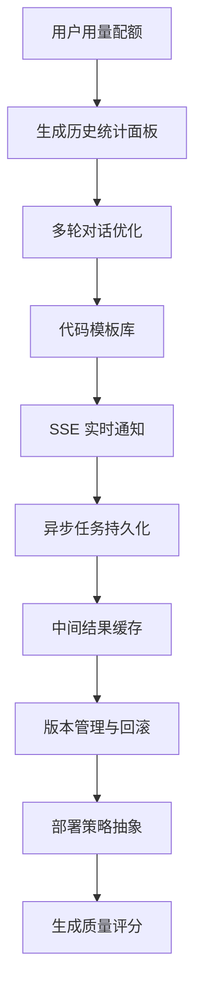

# 项目扩展功能建议

> 目标：把扩展方向从“功能清单”调整为“可落地路线图”。优先选择能降低成本、支撑商业化、提升生成链路稳定性的能力；对部署平台、质量评分这类容易膨胀的功能，先收窄边界再做。

## 推荐优先级总览

| 优先级 | 功能 | 实现难度 | 推荐结论 |
| --- | --- | --- | --- |
| P0 | 用户用量配额 | 低 | 商业化和防滥用基础能力，建议优先做 |
| P0 | 生成历史统计面板 | 低 | 已有 Token / 应用数据基础，适合先补齐用户可见价值 |
| P1 | 多轮对话优化 | 中 | 能明显提升生成体验，但要先限定为“基于当前应用的增量修改” |
| P1 | 代码模板库 | 中 | 对生成质量和速度都有帮助，建议先做少量高频模板 |
| P1 | WebSocket / SSE 实时通知 | 中 | 适合替代构建状态轮询，优先推荐 SSE，复杂度更低 |
| P2 | 异步任务持久化 | 中 | 分布式部署前需要做；当前单实例阶段可后置 |
| P2 | 生成结果缓存 | 中 | 不建议缓存完整代码生成结果，优先缓存确定性强的中间结果 |
| P3 | 蓝绿部署与版本回滚 | 高 | 很有价值，但依赖版本管理和部署产物规范，适合后期做 |
| P3 | 多平台部署策略 | 高 | 不建议一开始支持多平台，先把当前部署链路抽象干净 |
| P3 | 生成质量评分 | 高 | 展示给用户前需要评分可信度，建议先内部使用 |

---

## 1. 用户用量配额

- **现状**：目前已有频率限制，但缺少按用户、会员等级、时间周期统计的生成额度控制。
- **建议**：增加每日 / 每月生成次数、Token 消耗额度、构建次数额度，并支持普通用户和 VIP 用户差异化配置。
- **边界**：第一版只做“额度扣减 + 超额拦截 + 剩余额度展示”，不要先做复杂套餐、自动续费、企业空间等商业系统。
- **收益**：支撑 VIP 体系和成本控制，是商业化闭环的基础能力。
- **难度**：低。

---

## 2. 生成历史统计面板

- **现状**：系统已有应用、对话、Token 相关数据，但用户侧缺少清晰的生成消耗和成果统计。
- **建议**：面向用户展示生成次数、Token 消耗、应用类型分布、最近生成记录、部署次数等指标。
- **边界**：第一版以用户自助查看为主，不做复杂 BI，不做多维运营分析。
- **收益**：提升用户对资源消耗的感知，也能和配额、VIP、账单页面形成闭环。
- **难度**：低。

---

## 3. 多轮对话优化

- **现状**：对话历史已经存储，但生成链路对历史上下文的利用还不够强，用户进行局部修改时仍需要重复描述。
- **建议**：围绕当前应用建立增量修改能力，例如“把首页按钮改成深色”“增加一个登录弹窗”“把导航改成顶部布局”。
- **边界**：第一版只支持基于同一个应用的局部修改，不做跨应用记忆、长期用户画像和全局偏好学习。
- **收益**：降低用户迭代成本，让平台更像持续工作的生成工作台，而不是一次性代码生成器。
- **难度**：中。

---

## 4. 代码模板库

- **现状**：很多通用页面会重复从零生成，容易浪费 Token，也容易出现质量不稳定。
- **建议**：建立少量高频模板，例如登录页、管理后台、个人主页、活动页、作品集、电商首页等，再让 AI 基于模板做定制化修改。
- **边界**：第一版不要做完整模板市场，只需要内置模板和模板选择策略即可。
- **收益**：提升生成速度、降低成本，并让输出结果更稳定。
- **难度**：中。

---

## 5. WebSocket / SSE 实时通知

- **现状**：构建和部署状态主要依赖前端轮询，用户等待过程不够自然，也会产生无效请求。
- **建议**：增加实时通知通道，把生成阶段、构建完成、构建失败、部署完成等状态推送给前端。
- **边界**：优先推荐 SSE，因为当前主要是服务端向客户端单向推送；只有存在双向协作、多人编辑等场景时再上 WebSocket。
- **收益**：减少轮询，提高生成和部署过程的可感知性。
- **难度**：中。

---

## 6. 异步任务持久化

- **现状**：任务取消状态主要依赖内存管理，服务重启或多实例部署时状态会丢失。
- **建议**：将生成任务、构建任务、取消状态、失败原因、更新时间等任务元数据持久化到 Redis 或数据库。
- **边界**：如果任务状态需要长期追溯，建议进数据库；如果只是运行期协调，Redis 就足够。
- **收益**：支持服务重启恢复、多实例部署和更稳定的任务状态追踪。
- **难度**：中。

---

## 7. 生成结果缓存

- **现状**：相同或相似输入可能重复调用 AI，存在 Token 浪费。
- **建议**：不要直接缓存完整代码生成结果，优先缓存确定性更强的中间结果，例如生成类型路由、Prompt 增强结果、模板匹配结果、静态资源分析结果。
- **边界**：完整代码生成结果只适合用于“用户明确选择复用历史结果”的场景，不建议在后台自动命中并返回旧代码。
- **收益**：在不牺牲生成灵活性的前提下降低成本。
- **难度**：中。

---

## 8. 蓝绿部署与版本回滚

- **现状**：部署后缺少版本概念，用户无法快速回到上一个稳定版本。
- **建议**：先建立应用版本表和部署产物记录，每次成功构建或部署后生成一个可追溯版本，再提供回滚入口。
- **边界**：第一版可以先做“历史版本恢复”，不一定立刻做完整蓝绿流量切换。
- **收益**：降低发布风险，增强用户对部署功能的信任。
- **难度**：高。

---

## 9. 多平台部署策略

- **现状**：部署逻辑容易和业务 Service 耦合，后续支持多平台时维护成本会变高。
- **建议**：先把当前部署链路抽象成统一部署流程，包括产物准备、上传、发布、状态查询、失败处理；等当前平台稳定后，再考虑 Vercel、Netlify、自建服务器等适配。
- **边界**：不建议第一版直接支持多个平台，否则配置、鉴权、回调、失败重试都会快速变复杂。
- **收益**：提高部署能力的扩展性，但短期不是最优先目标。
- **难度**：高。

---

## 10. 生成质量评分

- **现状**：已有质量检查节点，但质量结果主要服务于内部流程，没有形成稳定的用户可见反馈。
- **建议**：先把质量检查结果用于内部决策，例如是否重试、是否提示用户补充需求、是否标记高风险输出；等评分维度稳定后，再展示给用户。
- **边界**：不建议一开始展示“代码质量分、可访问性分、安全分”等大而全评分，否则评分可信度不足会削弱用户信任。
- **收益**：长期能提升用户信任，也能帮助系统选择更优生成结果。
- **难度**：高。

---

## 建议实施顺序

## 第一阶段建议范围

第一阶段建议只做以下 4 项：

1. 用户用量配额
2. 生成历史统计面板
3. 多轮对话优化
4. 代码模板库

这 4 项能最快形成业务闭环：用户有额度、能看到消耗、能持续迭代应用、生成结果更稳定。其余能力建议等生成链路和部署链路更稳定后再推进。
